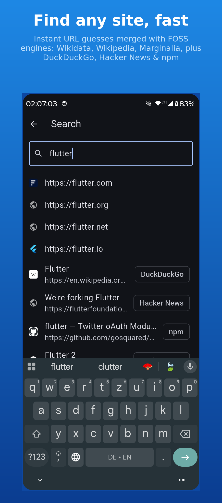
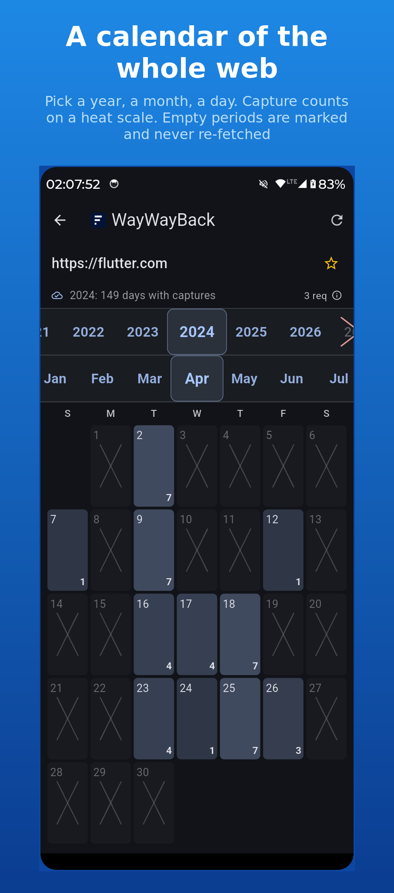
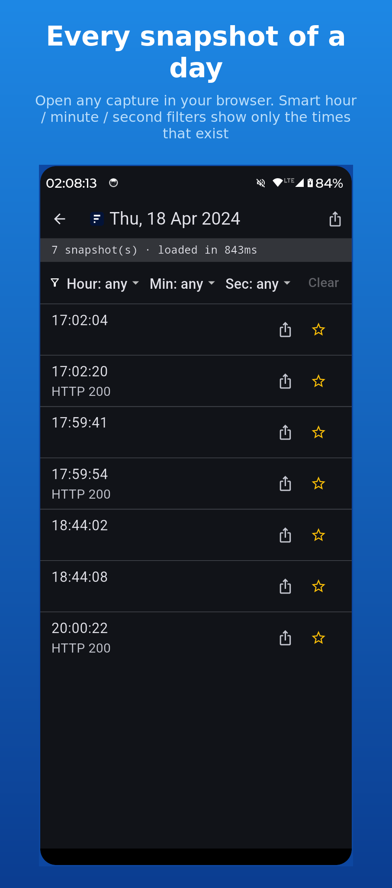
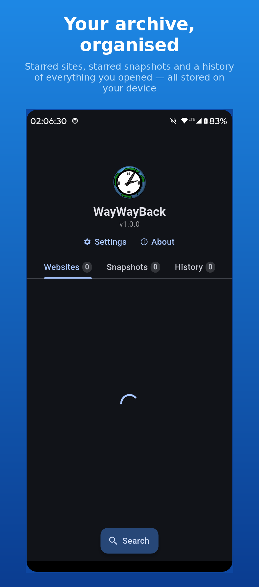
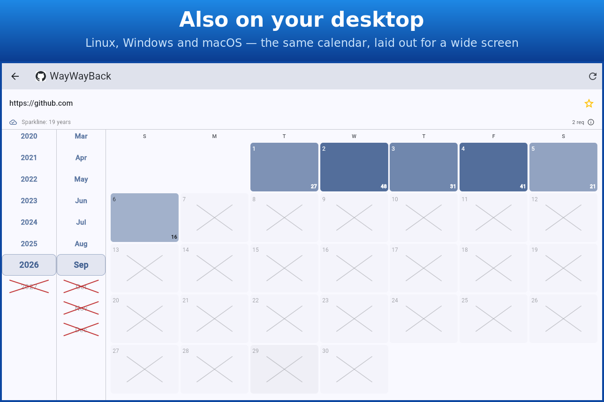

<div align="center">


# WayWayBack

**An unofficial, fully client-side browser for the Internet Archive Wayback Machine.**

Search for a site, then walk its history on a heat-map calendar — year → month → day —
and open any snapshot in your browser.

[](https://github.com/mkalmousli/wwb/releases)
[](https://github.com/mkalmousli/wwb/actions/workflows/release.yml)
[](LICENSE)
[](https://flutter.dev)

</div>

---

## Screenshots

| | | | |
|---|---|---|---|
|  |  |  |  |



## What it does

- **Year → month → day calendar.** Pick a year, a month and a day; every day cell
  shows how many times the site was captured, on a heat scale.
- **Genuinely fast.** It uses the Wayback Machine's own calendar endpoints
  (`sparkline` + `calendarcaptures`), fetches only the selected year, and caches
  results locally. Years and months that the archive says are empty are marked
  with a ✕ and never requested.
- **Per-day snapshot list** with smart hour / minute / second filters that only
  offer the times that actually exist.
- **Search** that merges instant URL guesses with keyless FOSS engines —
  **Wikidata** (official-website claim), **Wikipedia**, **Marginalia** — plus
  DuckDuckGo, Hacker News and npm.
- **Stars & history.** Star sites and snapshots; keep a local history of every
  link and capture you opened.
- **Share to open.** Share a URL into WayWayBack from any app to jump straight to
  its archive calendar. `wwb://open?url=…` deep links also work.
- **Themes & layout.** Light / dark / system, drag-to-reorder home tabs.
- **No account, no backend, no tracking, no ads.** Everything is stored locally.

## Install

- **Android:** grab an APK from the
  [latest release](https://github.com/mkalmousli/wwb/releases/latest)
  (`arm64-v8a` for most phones; `universal` works anywhere).
- **F-Droid:** the [`build.py`](build.py) reproducible build and
  [`metadata/`](metadata) are ready; an inclusion request is planned.
- **Desktop (Linux / Windows / macOS):** download the archive for your OS from
  the release, or build from source (below).

## Build from source

Requires the [Flutter SDK](https://docs.flutter.dev/get-started/install)
(pinned to **3.41.9** in [`.fvmrc`](.fvmrc)).

```sh
flutter pub get
dart run build_runner build      # generates the drift database code
flutter run -d android           # or: linux / windows / macos
```

### Reproducible APK

The release APK is built by [`build.py`](build.py), which pins the Flutter
version and builds at a fixed path so the output is byte-for-byte identical on
CI, in Docker and on the F-Droid server:

```sh
docker build -t wwb-build .
docker run --rm -v "$PWD":/tmp/app wwb-build /tmp/app/build.py   # -> app.apk
```

To sign it, drop a keystore next to `android/app/` and create
`android/key.properties` (both git-ignored):

```properties
storeFile=your-keystore.jks
storePassword=…
keyAlias=…
keyPassword=…
```

Without a key the build is debug-signed — fine for local use, and F-Droid
strips the signature when it verifies reproducibility anyway.

## How it works

```
lib/
  app.dart · main.dart          MaterialApp, theme, deep-link routing
  core/                         http client, favicon, theme, deep links, helpers
  data/
    wayback/wb_calendar.dart    __wb sparkline + calendarcaptures endpoints
    search/*                    Wikidata, Wikipedia, Marginalia, DuckDuckGo, HN, npm
    local/                      drift (SQLite) — sites, snapshots, settings,
                                history + tab order, TTL cache
  features/
    home/ search/ settings/ about/ day/
    link/                       link_controller.dart + scroll_selector,
                                month_calendar, request_details_dialog
```

Layers stay separated: **data → state (Riverpod) → UI**.

## Legal

WayWayBack is an **independent, unofficial** client. It is **not** the Wayback
Machine and is **not affiliated with, endorsed by, or connected to the Internet
Archive**. It has no backend of its own — it talks directly to the public
`web.archive.org` endpoints and stores all data locally on your device. All
archived content, trademarks and service marks belong to their respective owners.

## License

[GNU General Public License v3.0 or later](LICENSE). This program comes with
**absolutely no warranty**.
